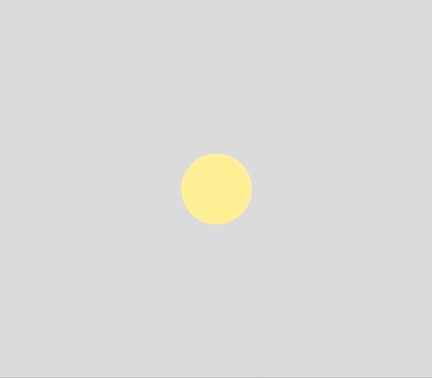
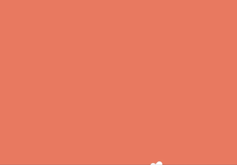
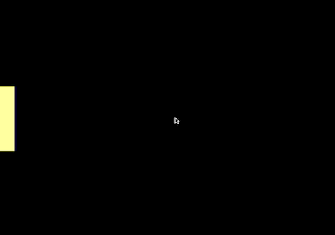

# p5js_codecreatif

Code for a creative coding class with designers.

Le but de ce cours est de recréer un page web inspirée de [patatap](https://patatap.com/).

L'ensemble des explication est consultable et téléchargeable sur ce dépot [github](https://github.com/b2renger/p5js_codecreatif).

P5js est un projet issu de processing qui est un langage de programmation basé sur java orienté vers la création graphique et interactive. P5js a pour but de transposer l'esprit de processing au web et donc au langage javascript. C'est un framework simple d'accès pour les débutants avec une bonne documentation et une communauté active. 

P5js propose l'intégration dans un canvas html5 d'un maximum de fonction pour le dessin et d'animation, des possibilités d'interaction à travers différentes interfaces homme machine (clavier, souris, webcam, micro ...), ou encore avec les composants d'une page web et un support partiel mais en développement de webgl.

Vous pouvez consulter [la référence de p5js](https://p5js.org/reference/) qui va décrire avec des exemples l'ensemble des fonction de p5js, mais n'hésitez pas à aussi consulter [les exemples](https://p5js.org/examples/) - qui peuvent par contre s'avérer être un peu plus compliqués à comprendre.

De nombreuses bibliothèques viennent offrir de nouvelles possibilité, mais  p5js peut naturellement s'interfacer avec n'importe quelle bibliothèques js.

Le plus simple est probablement de [télécharger](http://p5js.org/download/) et d'ajouter la bibliothèque js ou d'utiliser les liens cdn dans votre fichier index.html.

Pour rappel CDN signifie Content Delivery Network et permet de lier son code à des bibliothèques qui sont déjà hébergées en ligne.

Généralement un bon éditeur de texte suffit. A ce titre je vous conseille de jeter un oeil à l'introduction de ce cours [introduction à p5js](https://github.com/b2renger/Introduction_p5js). Les étapes de bases pour commencer à travailler avec [VSCode](https://code.visualstudio.com/) y sont décrites.

Les premières étapes de ce cours sont par ailleurs un pré-requis pour pouvoir aller plus loin sereinement, ainsi je vous invite à consulter les rubriques suivantes :

- [Comment travailler avec p5js](https://github.com/b2renger/Introduction_p5js#p5js_tools)
- [Principes de bases](https://github.com/b2renger/Introduction_p5js#bases)
- [Dessiner avec la souris](https://github.com/b2renger/Introduction_p5js#dessiner)
    - [Les couleurs et la transparence](https://github.com/b2renger/Introduction_p5js#couleurs)
    - [Utilisation de variables](https://github.com/b2renger/Introduction_p5js#simuler) 
    - [Réaliser des symétries](https://github.com/b2renger/Introduction_p5js#symetries) 

P5js recense un bon nombre de bibliothèques compatibles et revendiquant le même esprit : http://p5js.org/libraries/
Nous allons principalement utiliser la bibliothèque dédiée au son : [référence de p5.sound](https://p5js.org/reference/#/libraries/p5.sound).
Mais il peut aussi être utilisé avec n'importe quelles autres bibliothèques js.

Au terme des différentes étapes décrites ici vous devriez pouvoir arriver à ce résultat :

<br>

## CONTENU

* [Se familiariser avec p5js](#Se-familiariser-avec-p5js)<br>
    * [HTML et JS](#HTML-et-JS)
    * [Dessiner en javascript avec l'api processing](#Dessiner-en-javascript-avec-l'api-processing)
* [Charger et jouer un son](#Charger-et-jouer-un-son)<br>
* [Analyser le volume du son et animer notre cercle](#Analyser-le-volume-du-son-et-animer-notre-cercle) - [**DEMO**](https://b2renger.github.io/p5js_codecreatif/exemple02/)<br>
* [Ajouter plusieurs sons et declencher leur lecture avec des touches de clavier](#Ajouter-plusieurs-sons-et-declencher-leur-lecture-avec-des-touches-de-clavier) - [**DEMO**](https://b2renger.github.io/p5js_codecreatif/exemple03/)<br>
* [Realiser des animations audio-réactives](#Realiser-des-animations-audio-reactives) - [**DEMO1**](https://b2renger.github.io/p5js_codecreatif/exemple04/) - [**DEMO2**](https://b2renger.github.io/p5js_codecreatif/exemple05/) - [**DEMO3**](https://b2renger.github.io/p5js_codecreatif/exemple06_3D)<br>
    * [Couleur réagissant au volume d'un son](#Couleur-reactive-au-volume)<br>
    * [Rayon d'un cercle reactif à la position de lecture](#Rayon-d'un-cercle-reactif-a-la-position-de-lecture)<br>
    * [Rotation d'un rectangle dependant de la position de lecture](#Rotation-d'un-rectangle-dependant-de-la-position-de-lecture)<br>
    * [Calculer l'energie d'une bande de frequence avec une FFT](#Calculer-l'energie-d'une-bande-de-frequence-avec-une-FFT)<br>
    * [Dessiner une waveforme](#Dessiner-une-waveforme)<br>
    * [Parcourir un cercle a l'aide des coordonnees polaires](#Parcourir-un-cercle-a-l'aide-des-coordonnees-polaires)<br>
    * [Deplacement de points](#Deplacer-un-ensemble-de-points)<br>
    * [Utiliser de la 3D](#Utiliser-de-la-3D)<br>
* [Perfectionner sa technique](#Perfectionner-sa-technique)<br>
    * [Dessiner dans un calque](#Dessiner-dans-un-calque) - [**DEMO**](https://b2renger.github.io/p5js_codecreatif/techniques_offscreen_graphics)<br>
    * [Utiliser animejs pour creer des animations](#Utiliser-animejs-pour-creer-des-animations) - [**DEMO**](https://b2renger.github.io/p5js_codecreatif/techniques_animejs)<br>
        * [Faire varier le rayon d'un cercle avec une fonction de easing sur mesure](#Faire-varier-le-rayon-d'un-cercle-avec-une-fonction-de-easing-sur-mesure)<br>
        * [Constuire une animation se deroulant en plusieures etapes](#Constuire-une-animation-se-deroulant-en-plusieures-etapes)


## Se familiariser avec p5js 

Un programme p5js est destiné à être utilisé dans une page web. Généralement en dispose d'un fichier *index.html* qui nous permet de définir notre page web et les fichiers ressources (liens vers les bibliothèques) et d'un fichier *sketch.js* qui va être notre programme écrit en javascript.

### HTML et JS

Le fichier *sketch.js* est lié au fichier *index.html* par une déclaration dans ce dernier.

```HTML
<script language="javascript" type="text/javascript" src="sketch.js"></script>

```
Lorsqu'on ouvre le fichier *index.html* celui-ci executera alors le fichier *sketch.js* dans la page web.

Dans le cas de nos exemples nous trouverons les bibliothèques javascripts dans un dossier **/bibliothèques** dédié : on y trouve *p5.js*, *p5.dom.js*, *p5.sound.js*.

Le fichier *index.html* ressemblera donc à ceci si on utilise toutes les bibliothèques et que notre dossier **p5** contenant tous les fichiers téléchargés depuis le site web de processing, est au même niveau que notre dossier contenant notre fichier **html**. Ce fichier **html** nous sert en fait à préciser au navigateur où se trouvent les bibliothèques nécessaires à l'éxecution de notre programme (le fichier **js**).

```HTML
<html>
<head>
  <meta charset="UTF-8">
  <script language="javascript" type="text/javascript" src="../p5/p5.js"></script>
  <script language="javascript" type="text/javascript" src="../p5/addons/p5.dom.js"></script>
  <script language="javascript" type="text/javascript" src="../p5/addons/p5.sound.js"></script>
  <script language="javascript" type="text/javascript" src="sketch.js"></script>
  <style> * {padding: 0; margin: 0; overflow-y: hidden; scrollbar-width: none;} 
	  ::-webkit-scrollbar { display: none; } 
  </style>
</head>
<body>
</body>
</html>
```

Notre fichier *sketch.js* est notre code écrit en javascript. Par défaut : il contient deux fonctions nécessaires à l'éxecution des fonctions de l'api p5js (Application Programming Interface)

```javascript
/* la fonction setup est exécutée une seule fois au début :
au chargement de la page, elle est délimitée par deux accolades
*/
function setup() {

}
/* la fonction draw est exécutée en boucle, une fois le setup terminé.
Chaque éxectution de la fonction draw va correspondre au dessin d'une image ou frame
*/
function draw() {
  
}

```

La fonction **setup()** est executée une fois à chaque chargement de la page, elle est utile pour initialiser des valeurs ou créer des éléments de page web - comme un canvas pour dessiner :

```javascript
function setup() {
    // créer un objet de type HTML5 canvas aux dimensions de la fenêtre de notre navigateur
	createCanvas(windowWidth,windowHeight) 
}
```

**windowWidth** et **windowHeight** sont des **variables** disponnible dans processing pour renseigner le programme sur la taille de la fenêtre du navigateur de l'utilisateur.

Une **variable** est quant à elle un espace mémoire dans le navigateur accessible par notre programme. En javascript nous devrons créer et manipuler des variables régulièrement, mais p5js dispose de certaines variables déjà nommées pour connaitre l'état du navigateur ou la position de la souris ou même encore les touches pressées par l'utilisateur.

La fonction **draw()** est elle une boucle infinie : le code entre les deux accolades est éxecuté en boucle par votre navigateur aussi vite que possible. Cela tranche avec le principe évenementiel du javascript, mais ici nous allons faire des applications interactives avec de l'animation.

Une autre chose qui peut-être importante est la notion de réactivité à la fenêtre dans laquelle on dessine. Par exemple un utilisateur pourrait vouloir redimensionner la fenêtre de son navigateur pendant l'éxectution de votre page web. Pour cela il existe une fonction qui va permettre de redimensionner le canvas dans lequel on dessine à la nouvelle taille de la fenêtre du navigateur.

```javascript
function windowResized() {
    // redimensionner dynamiquement notre canvas aux dimensions de la fenêtre de notre navigateur
	resizeCanvas(windowWidth,windowHeight) 
}
```
Voici des liens vers les pages de références concernant ces principales fonctions :

https://p5js.org/reference/#/p5/createCanvas

https://p5js.org/reference/#/p5/resizeCanvas

[**home**](#Contenu)

### Dessiner en javascript avec l'api processing

Le code de dessin va généralement s'écrire dans la fonction **draw()**. Par exemple pour dessiner un cercle nous alllons appeler la fonction **ellipse()** dont voici la page de référence :

https://p5js.org/reference/#/p5/ellipse

Entre parenthèse nous devons rentrer des **paramètres** qui sont séparés par des virgules. Certains paramètres sont optionnels, s'ils ne sont pas renseignés ils auront des valeurs par défaut.

Dans un souci de rendre notre code réactif aux changement de la taille de notre fenêtre, nous allons exprimer les coordonées de l'endroit auquel nous allons dessiner notre ellipse en pourcentage de la largeur et de la hauteur de notre zone de dessin.

```javascript
    // on dessine une ellipse au milieu, d'une taille de 50 pixels
    ellipse( width*0.5, height*0.5 , 50, 50,1);
    /* on utilise width, qui stocke la largeur de notre zone de dessin et height qui stocke sa hauteur.
    on utilise un multiplicateur en pourcentage pour signifier  que l'ellipse sera au milieu de cette zone.
    */
```

Vous pourrez changer la couleur de **remplissage** de votre ellipse en utilisant ces fonctions :

https://p5js.org/reference/#/p5/fill

https://p5js.org/reference/#/p5/noFill

et changer la couleur et l'aspect du **contour** en vous référant à ces fonctions :

https://p5js.org/reference/#/p5/stroke

https://p5js.org/reference/#/p5/noStroke

https://p5js.org/reference/#/p5/strokeWeight

https://p5js.org/reference/#/p5/strokeCap

https://p5js.org/reference/#/p5/strokeJoin

Il est bien sûr possible de dessiner d'autres formes géométriques. Vous pouvez vous référer à la catégorie **Shape** de la page de référence.

**L'exemple01** reprend ces différents éléments et les formalisent dans un programme fonctionnel permettant de dessiner un cercle au centre de notre fenêtre, ce cercle reste au centre de la fenêtre même si l'utilisateur redimensionne sa fenêtre.

[**home**](#Contenu)

## Charger et jouer un son

Vous pourrez trouver des sons en license libre [Creative Commons](https://creativecommons.org/) sur le site [freesound](https://freesound.org/). Il vous suffit de créer un compte (gratuit), puis de chercher ...

A l'utilisation il vous suffira de mentionner l'auteur du son pour être en règle.

Pour pouvoir charger et jouer un son nous allons nous référer à la page dédié à l'objet **SoundFile** de la bibliothèque son de p5js :

https://p5js.org/reference/#/p5.SoundFile

Cet objet une fois créée, grâce à la méthode **loadSound()**, permet de faire tout un tas de choses avec ce fichier audio par exemple le jouer avec la méthode **.play()** mais aussi de le jouer en boucle **.loop()**, de régler son volume **.setVolume()** etc.

Il est important de comprendre que la méthode **loadSound()** retourne un **objet** que l'on peut ensuite manipuler, cet objet va être stocké dans une **variable** - définie avec le mot clé *var* et qui va porter un nom de nôtre choix.

```javascript
var song;
```
Ce code permet de créer une variable qui s'appelera *song*. Pour l'instant cette variable ne contient rien, ce n'est rien de plus qu'une étiquette avec un nom marqué dessus.

Nous allons lui attribuer une valeur en appelant la fonction **loadSound()** :
```javascript
song = loadSound('assets/386927__gumballworld__music-box.mp3');
```
après cette ligne notre variable sera un objet **Soundfile** portant le nom *song*, il permettra de manipuler le fichier *.mp3* nommé *386927\__\_gumballworld\__\_music-box.mp3* stocké dans un dossier nommé **assets** situé au même niveau que nos fichier html et js.

Une fois que notre objet est créée nous pouvons le lire en boucle en appelant la méthode **.loop()** :
```javascript
song.loop();
```
Si nous le faisons dans le **setup()** : au chargement de la page notre son commencera à se lire en boucle. Voici donc le code complet permettant de lire un son en boucle au chargement de la page. Comprenez bien cette fois que la méthode **.loop()** s'applique sur un objet de type **SoundFile**, c'est d'ailleurs à cela que sert le **"."** : il s'agit d'un accesseur; il permet de rentrer dans un objet et d'accéder à ses propriétés, ses méthodes. Vous ne pouvez donc utiliser la méthode **.loop()** que si elle est précisée dans la documentation de l'objet.

```javascript
var song;
// la fonction preload permet de charger des éléments (son, images, vidéos etc.) avant le démarrage du programme
function preload() {
  song = loadSound('assets/386927__gumballworld__music-box.mp3');
}

function setup() {
    createCanvas(windowWidth, windowHeight);
    background(0);
    song.loop();
}

function draw() {
    background(0);
    ellipse( width*0.5, height*0.5 , 50, 50);
}

function windowResized(){
    resizeCanvas(windowWidth, windowHeight);
    background(0);
}
```
[**home**](#Contenu)

## Analyser le volume du son et animer notre cercle 

Nous allons maintenant nous intéresser à la manière dont nous allons pouvoir calculer le niveau sonore de notre fichier audio en train de lireet faire réagir notre cercle à celui-ci.

Nous allons pour cela utiliser un objet de type **Amplitude** dont la documentation est disponible à cette page :

https://p5js.org/reference/#/p5.Amplitude

Pour créer cet objet, nous allons d'abord créer une **variable** qui se situera avant le **setup()**
```javascript
var analyzer;
```
Ce code permet de créer une variable qui s'appelera *analyzer*. Pour l'instant cette variable ne contient rien, ce n'est rien de plus qu'une étiquette avec un nom marqué dessus - ce nom peut-être celui que vous souhaitez.

Dans le **setup()** nous allons maintenant que cette variable sera un analyseur audio en appellant le **constructeur** de l'objet **Amplitude**
```javascript
analyzer = new p5.Amplitude();
```
après cette ligne notre variable "analyzer" sera donc reconnue par notre code comme étant un objet de type **Amplitude** nous pouvons donc maintenant appelé dessus les méthodes décrites dans la documentation en utilisant le **"."** comme accesseur.

La première chose que nous devons faire est de connecter cet analyseur de volume à notre objet qui va jouer notre fichier audio, afin que le flux audio qui sorte de notre objet **SoundFile** entre dans notre objet **Amplitude** pour être analysé. Cela se fait avec la méthode **.setInput()**
```javascript
analyzer.setInput(song);
analyzer.toggleNormalize(); // s'assurer que notre analyseur renvoie une valeur comprise entre 0 et 1
```
Cette ligne de code se place dans le **setup()** car cette action ne doit s'effectuer qu'une seule fois.

A partir de maintenant nous allons animer notre cercle. Pour cela le code que nous allons écrire se placera dans le **draw()**. 
La première chose que nous allons faire et de récupérer le niveau sonore du son en train de jouer et le stocker dans une nouvelle variable en appelant la méthode **.getLevel()** de l'objet **Amplitude**.
```javascript
var rms = analyzer.getLevel();
```
Ici nous créeons une variable et lui attribuons une valeur en une seule et même ligne. Etant donné que **.getLeve()** nous retourne une valeur comprise entre 0 et 1, *rms* contiendra à chaque frame un nombre à virgule compris entre 0 et 1 correspondant au niveau sonore émis par l'objet **SoundFile** à cette frame.

Cette variable *rms* est crééee à l'intérieur du **draw()** et n'existe donc que dans ce **bloc de code**, c'est à dire entre les deux accolades délimitant la fonction **draw()**.

Nous allons maintenant pouvoir transformer cette variable par des opérations mathématiques à l'aide de la fonction **map()** dont voici la page de documentation : 

https://p5js.org/reference/#/p5/map

Cette fonction permet de transformer une valeur se trouvant dans un intervalle définit pour lui faire correspondre une valeur dans un nouvel intervalle.
Ici nous allons créer deux variables une pour controller la taille de notre ellipse : *ellipseSize* et une pour controller la transparence de notre ellipse : * ellipseAlpha*. 

```javascript
var ellipseSize = map(rms, 0, 1, 50 800); // rms est compris entre 0 et 1 et nous voulons une valeur comprise entre 5O et 800 pour controller la taille
var ellipseAlpha = map(rms, 0, 1, 0, 255);// rms est compris entre 0 et 1 et nous voulons une valeur comprise entre 5O et 800 pour controller la transparence
```
Maitenant que nous avons calculé deux valeurs utiles et dans des intervalles de valeurs appropriés, il ne nous reste plus qu'à les utiliser.

 ```javascript
    fill(255);
    ellipse( width*0.25, height*0.5 , ellipseSize, ellipseSize);
    
    fill(255, 100, 100, ellipseAlpha);
    ellipse( width*0.75, height*0.5 , 250, 250);
```
**L'exemple02** reprend ces différents éléments et les formalisent dans un programme fonctionnel permettant de dessiner un cercle au centre de notre fenêtre, ce cercle reste au centre de la fenêtre même si l'utilisateur redimensionne sa fenêtre.

[**home**](#Contenu)<br>

## Ajouter plusieurs sons et declencher leur lecture avec des touches de clavier

La première chose à faire va être de créer un dossier "assets" à la racine de notre répértoire de travail, dans ce dossier nous allons ranger tous les fichiers nécessaires au bon fonctionnement de notre programme. 

A l'étape précédente nous avions créée ce dossier à l'intérieur de notre exemple (à côté des fichiers "sketch.js" et "index.html"), ici les fichiers que nous allons importer seront utiles à tous les exemples suivants, il est donc préférable de le placer à côté du dossier "/p5" contenant nos bibliothèques.

A des fins de démonstrations j'ai choisi d'utiliser un pack nommé [Human Beatbox créée sur freesound.org par l'utilisateur Snapper 4298](https://freesound.org/people/Snapper4298/packs/11581/), il s'agit de sons percusifs et relativement courts qui seront parfaitement adaptés à nos besoins. J'ai aussi téléchargé un pack de [Stabs créée joviva](https://freesound.org/people/Jovica/packs/137/) et quelques sons d'ambiances que l'on appelle communément "drones". J'ai aussi choisi quelques sons dits de "drone" que j'ai copié directement dans le dossier assets.

Nous allons commencer par charger différents sons dans nôtre page : tout se passe comme à l'étape précédente.

```javascript
var kick1 // créer une variable pour stocker un premier son
var stab1 // créer une variable pour stocker un deuxième son
var drone1 // créer une variable pour stocker un troisième son

function preload() {
    // on charge les deux sons à partir du dossier assets situé à la racine de notre répertoire de travail
    kick1 = loadSound("../assets/11581__snapper4298__human-beatbox/183384__snapper4298__hit-hat-looper.wav")
    stab1 = loadSound("../assets/137__jovica__stab-pack-01/2345__jovica__stab-020-mastered-16-bit.wav")
    drone1 = loadSound("../assets/217490__jarredgibb__drone-002.wav")
}

```

Maintenant nous allons nous ateller à déclencher un son lorsque l'on appuie sur une touche de clavier : la fonction **keyIsDown()** est faite pour cela et sa documentation est disponible à cette page : 

https://p5js.org/reference/#/p5/keyIsDown

Vous remarquerez qu'il faut  connaitre le code clavier de chaque touche et donc consulter cette page : http://keycode.info/

Le code clavier pour la touche 'a' est 90, et la fonction keyIsDown() prendra une **valeur booléenne** - c'est à dire **vrai** ou **faux** en fonction de si on appuie sur la touche concernée.

Si vous écrivez le code ci-dessous dans la fonction **draw()** et que vous ouvrez la console de votre navigateur, vous verrez affiché **true** si vous appuyez sur 'a' et **false** si vous n'appuyez pas sur 'a'.

```javascript
console.log(keyIsDown(65)) // console.log() permet d'afficher des choses dans la console de votre navigateur    
```

Il faut que nous soyons capable de dire à notre page web quelque chose comme : "si on appuie sur la touche 'a' on doit jouer le son chargé dans la variable 'kick1'". Pour cela il existe dans tous les langages un mot-clé qui est **if(){}**. La syntaxe est la suivante : si la condition spécifiée entre parenthèse est vraie alors on éxecute le code entre accolades.

Il n'existe pas de page de documentation de la structure **if** sur le site de p5js, mais vous pouvez vous référer à la page présente dans la documentation de processing (version java) : 

https://processing.org/reference/if.html


```javascript
if (keyIsDown(65) == true){ // si on appuie sur la touche 'a'
    kick1.play(); // on enclenche la lecture du son kick1
}
```
Tout cela est très bien, mais malheureusement et cela même si le code fonctionne comme prévu, le son grésille énormément, cela est du au fait que le **draw()** s'éxécute très vite et lorsque vous appuyez sur une touche votre doigt reste sur la touche le temps de l'éxecution de plusieurs itération du **draw()**, le son est donc déclenché plusieurs fois et cela sature vos haut-parleurs. 

Il faut donc s'assurer que le son n'est pas déjà en train de jouer lorsqu'on enclenche sa lecture. Heureusement il existe pour les objets de type SoundFile une méthode **isPlaying()** qui nous renvoie encore une fois une **variable booléenne** : **vrai** si le son est déjà en train de jouer et **faux** sinon.

Voici la page de documentation de cette méthode : https://p5js.org/reference/#/p5.SoundFile/isPlaying

On peut alors "encapsuler" des **if** - mais attention aux parenthèses et accolades !

```javascript
if (keyIsDown(65) == true){ // si on appuie sur la touche 'a'
    if(kick1.isPlaying() == false){ // si le son kick1 n'est pas déjà en train de jouer
        kick1.play(); // on enclenche la lecture du son kick1
    }
}
```

Ou alors on peut utiliser des opérateurs logiques (encore une fois on trouvera leur documentation sur le site de processing - mais ce sont les mêmes dans tous les langages de programmation) :

- le ET logique : https://processing.org/reference/logicalAND.html
- le OU logique : https://processing.org/reference/logicalOR.html
- la NON logique : https://processing.org/reference/logicalNOT.html

On peut donc aussi écrire le code ci-dessus de cette manière :

```javascript
//si on appuie sur la touche 'a' ET si le son kick1 n'est pas déjà en train de jouer
if (keyIsDown(65) == true && kick1.isPlaying() != true){
    kick1.play(); // on enclenche la lecture du son kick1
}
```
Cette fois-ci nous avons atteint notre objectif.

Mais cette méthode nous contraint à écrire un peu trop de lignes de code pour jouer un son. Nous allons donc écrire une **fonction** qui nous permettra de généraliser la manière dont nous voulons lire un son. Une fois cette fonction définie nous n'aurons plus qu'à l'**appeler** avec des paramètres sur mesure pour lire tel ou tel son en appuyant sur telle ou telle touche.

Le code ci-dessous permet de définir une fonction en javascript. On la place en dehors de toute autre fonction déjà prédéfinie par p5js, c'est à dire en dehors de **preload**, **setup**, **draw** ou **windowResized**; cela nous assure de pouvoir l'appeler de n'importe quel endroit de notre code, même si typiquement nous l'appelerons dans le **draw**.

Cette fonction pourra être appelée avec plusieurs **arguments** : les **arguments** sont les valeurs que l'on passe en **paramètre** c'est à dire **entre les parenthèses**. Cette fonction est donc générique : elle définit un comportement globale que l'on pourra appliquer à plusieurs couples de son / identifiant de touche clavier. Au moment où on appelera cette fonction dans le draw() les variables "sound" et "keyId" seront remplacées par celles fournies entre parenthèse.

Voici donc la définition de la fonction :

```javascript
function playSound(sound, keyId) { // playSound est définie comme pouvant prendre deux paramètres : un son et un nombre 
    // on vérifie si on appuie sur la touche portant le numéro keyId, et on vérifie que le son n'est pas déjà en train de jouer
    if (keyIsDown(keyId) == true && sound.isPlaying() == false) {
        sound.play(); // si c'est le cas on enclenche la lecture du son.
    }
}
```

Si maintenant on souhaite l'appeler, on le fera dans le draw() et il faudra fournir entre parenthèses un objet SoundFilet et un nombre (l'identifiant clavier de la touche qui doit permettre de jouer le son).

```javascript
//si on appuie sur la touche 'z' qui porte l'identifiant 90, le son stab1 se jouera.
playSound(stab1, 90);
// on appelle une seconde fois la méthode 'playSound' mais cette fois avec le son 'drone1' et l'identifiant clavier 60
// et donc si on appuie sur 'e' le son drone1 se jouera.
playSound(drone1, 69);
```
Il faut bien sur que les variables "stab1" et "drone1" aient été définies au préalable et les avoir assignées à des sons dans la fonction **preload()**.

Le code permettant de faire tout cela est récapitulé dans le dossier "exemple03".


[**home**](#Contenu)<br>

## Realiser des animations audio-reactives 

### Couleur reactive au volume

<br>

Notre première animation consiste à changer la couleur du fond en fonction du volume d'un son : 
- il faut récupérer le volume du son à l'aide d'un analyseur audio 
- le volume étant compris par défaut entre 0 et 1, il faut transformer cette valeur dans un intervalle cohérent avec l'expression d'une couleur (ici en niveau de gris).
- dessiner une forme géométrique utilisant cette couleur de remplissage.
    
Nous allons choisir pour cela un son plutôt court et percussif que nous appelerons 'stab2', il sera déclenché lorsque nous appuierons sur la lettre 'r'. Le code ci-dessous ne présente rien de nouveau comparé à ce que nous avons déjà vu.

```javascript
var stab2
var stab2Amp

function preload() {  
    stab2 = loadSound("../assets/137__jovica__stab-pack-01/2330__jovica__stab-005-mastered-16-bit.wav")
}
function setup() {
    createCanvas(windowWidth, windowHeight);
    background(0);
    // on créée un objet de type Amplitude pour analyse le niveau sonore de notre son (comme dans l'exemple02)
    stab2Amp = new p5.Amplitude()
    stab2Amp.setInput(stab2) // on 'branche' cet analyseur à notre son drone1.
}

function draw() {

    background(180)
    noStroke()
    playSound(stab2, 82) //'r' == stab2
}

```

Nous allons maintenant déclencher une animation si notre son est actuellement en train de jouer. Nous allons utiliser un **if** et nous allons encadrer le code qui permet de réaliser notre animation des fonctions **push()** et **pop()**. Ces fonction ont pour but de nous permettre de réaliser des changement liés au style (stroke, fill, strokeWeight, colorMode ...) ainsi qu'aux transformations de l'espace (translate, rotate, rectMode ...) sans que celles-ci soient répercutées sur les animations suivantes.

Voici la page de documentation liées à ces fonctions :
- https://p5js.org/reference/#/p5/push
- https://p5js.org/reference/#/p5/pop


```javascript
if (stab2.isPlaying() == true) { // si le son joue on affiche notre animation.
        push() // pousser un nouveau référentiel de coordonnées et de style 
        
        // (...)  notre code d'animation sera écrit ici
                                
        pop() // restaurer le référentiel initial
}
```

Notre animation va être relativement simple puisqu'il s'agit de dessiner une forme statique et de faire réagir sa couleur à l'amplitude du son. Nous devons donc d'abord analyser le son et récupérer son amplitude ( pour rappel : [documentation de p5.Amplitude](https://p5js.org/reference/#/p5.Amplitude)).

Nous avons déjà initialisé l'analyseur de volume 'stab2Amp' et l'avons déjà connecté à notre son 'stab2' dans le **setup()** car c'est une opération qui n'a besoin d'être effectuée qu'une seule fois.

Nous pouvons donc stoker dans une variable 'amp' la valeur analysée grâce à cette ligne de code à insérer juste après l'appel de push(). On appelle la fonction **.getLevel()** sur notre objet 'stab2Amp' et nous obtiendrons alors une valeur comprise entre 0 et 1 (0 représentant le silence et 1 représentant le volume maximal).

```javascript
var amp = stab2Amp.getLevel() // amp contient une valeur entre 0 et 1
```

Nous avons donc une valeur entre 0 et 1 pour décrire le volume et nous voulons maintenant une valeur qui nous permettra de controller un niveau de gris. De manière classique un niveau de gris est compris entre 0 (noir) et 255 (blanc), il faut donc que nous réalisions un calcul mathématique à l'aide de la fonction **map()**.

https://p5js.org/reference/#/p5/map

Comme décrit cette fonction reçoit 5 paramètres : la valeur à transformer, sa valeur minimale, sa valeur maximale, la valeur minimale que l'on souhaite obtenir et la valeur maximale que l'on veut. Cette fonction est très utile et sera utilisée très régulièrement, vous la retrouverez dans beaucoup de langages de programmation (processing, arduino etc.).

```javascript
var whiteLevel = map(amp, 0, 1, 210, 255) 
```

Avec la ligne de code ci-dessus nous transformons donc notre valeur de amp qui est comprise entre 0 et 1 en une valeur comprise entre 210 et 255, et nous stockons le résultat de ce calcul dans une nouvelle variable nommée 'whiteLevel' nous pourrons donc l'utiliser pour dessiner un carré dont la couleur de remplissage changera en fonction du volume.

```javascript
noStroke()
fill(whiteLevel)
rect(0, 0, width, height)
```
Notre code complet d'animation ressemblera donc à ceci :

```javascript
if (stab2.isPlaying() == true) { // si le son joue on affiche notre animation.
    push() // pousser un nouveau référentiel de coordonnées et de style (pour éviter que nos changements n'affectent le reste de nos dessin)
    var amp = stab2Amp.getLevel() // obtenir le niveau sonore à l'aide de notre analyseur et le stocker dans une variable nommée amp
    var whiteLevel = map(amp, 0, 1, 210, 255) // transformer 'amp' qui est comprise entre 0 et 1 en une nouvelle valeur entre 0 et 255
    // dessiner un carré blanc de la taille de notre fenêtre dont la teinte est contrôllé par whiteLevel qui dépend elle même du 
    // niveau sonore de notre son en train de jouer.
    noStroke()
    fill(whiteLevel)
    rect(0, 0, width, height)
    pop()
}
```

[**home**](#Contenu)<br>

### Rayon d'un cercle reactif a la position de lecture

<br>

Notre deuxième animation va aussi être relativement simple, nous allons nous attacher à représenter la progression de la lecture du son. Nous allons utiliser un son encore une fois relativement court que nous allons nommer 'kick1' et que nous allons déclencher en appuyant sur 'a'.

Il faut donc d'abord initialiser une variable qui stockera le son en question et charger le son dans **preload()** à l'aide de la fonction **loadSound**.

```javascript
var kick1

function preload() {  
    kick1 = loadSound("../assets/11581__snapper4298__human-beatbox/183384__snapper4298__hit-hat-looper.wav")
}
```

Il faut ensuite déclencher la lecture du son en appuyant sur 'a' et préparer la condition qui nous permettra de jouer notre animation, comme précédement :

```javascript
playSound(kick1, 65); // 'a' == kick1
if (kick1.isPlaying() == true) {
    push()
    //(..)
    pop()
}
```

Nous allons maintenant nous attacher à récuperer les valeur de lecture du son. En regardant la documentation de l'objet [SoundFile](https://p5js.org/reference/#/p5.SoundFile), nous pouvons remarquer deux méthodes intéressantes **.currentTime()** qui nous donnera la position de la tête de lecture et **.duration() qui nous donnera la durée totale du son.

Nous pouvons du coup utiliser la fonction **map()** vue précédement pour arriver à calculer une valeur qui dépendera de la position de lecture et qui pourra être utilisée comme rayon d'une **ellipse()**.

**kick1.currentTime()** et la valeur que nous voulons mapper (ou transformer), elle est comprise entre 0 et **kick1.duration()** et nous voulons obtenir une valeur comprise entre 50 et width. Nous stockons le résultat dans une nouvelle variable que nous nommerons "radius"

```javascript
var radius = map(kick1.currentTime(), 0, kick1.duration(), 50, width) 
```

Il ne nous reste donc plus qu'à dessiner l'ellipse en question :

```javascript
fill(255, 220, 0)
ellipse(width * 0.5, height * 0.5, radius, radius)
pop()
```

Notre ellipse sera donc jaune, centrée (quelque soit la taille de la fenêtre) et d'un rayon valant 50 au début de la lecture du son jusqu'à recouvrir tout l'écran à la fin de la lecture du son.

Voici le code complet de l'animation :

```javascript
playSound(kick1, 65); // 'a' == kick1
if (kick1.isPlaying() == true) {
    push()
    var radius = map(kick1.currentTime(), 0, kick1.duration(), 50, width) 
    fill(255, 220, 0)
    ellipse(width * 0.5, height * 0.5, radius, radius)
    pop()
}
```

[**home**](#Contenu)<br>

### Rotation d'un rectangle dependant de la position de lecture

<br>

Cette fois-ci nous allons controller la rotation d'un rectangle avec la même technique que précédement. Ce son sera nommé 'stab1' et il sera déclenché par appuie sur la touche 'z' du clavier.

D'abord nous devons initialiser la variable et charger le son :

```javascript
var stab1

function preload() {  
    stab1 = loadSound("../assets/137__jovica__stab-pack-01/2345__jovica__stab-020-mastered-16-bit.wav")
}
```

Nous pouvons ensuite lire le son et préparer notre condition pour l'animation :
```javascript
playSound(stab1, 90); // 'z' == stab1
if (stab1.isPlaying() == true) {
    push()
    //(...)
    pop()
}
```
Nous allons encore utiliser **.currentTime()** et **.duration()** ainsi que la fonction **map()**, mais cette fois ci nous voulons transformer notre valeur dans un **range** utile pour une rotation, dans processing les rotations s'expriment en radians - et du coup entre 0 et PI pour un demi-tour et 0 et 2 PI pour un tour complet.

Vous pouvez utiliser [ce sketch p5js](https://www.openprocessing.org/sketch/151087) pour vous rafraichir la mémoire.

```javascript
var rotation = map(stab1.currentTime(), 0, stab1.duration(), 0, PI)
```
Il faut maintenant réaliser la rotation à proprement parler. Nous voulons faire tourner un rectangle et nous voulons le faire tourner autour de lui-même et nous voulons que ce rectangle soit placé au centre de notre fenêtre.

- [**translate()**](https://p5js.org/reference/#/p5/translate) : nous permet d'effectuer une translation, en passant entre parenthèse les coordonnées du point vers lequel nous voulons nous déplacer.
- [**rotate()**](https://p5js.org/reference/#/p5/rotate) : nous permet d'effectuer une rotation autour de l'origine de notre reprère, en passant entre parenthèse un angle en radians.

Par défaut dans p5js, comme dans processing, le point de coordonnées (0,0) est placé en haut à gauche de notre fenêtre, en appelant **translate()** et **rotate()** on déplace en fait ce point de coordonnées. En combinant ces éléments avec **push()** et **pop()** qui permettent respectivement de 'pousser' un nouveau repère pour faire des transformations dessus et **pop()** qui permet de restaurer notre ancien repère, on peut arriver à faire énormément de choses.

Pour plus d'informations vous pouvez vous référer à [ce tutoriel](http://genekogan.com/code/p5js-transformations/) - écrit par Gene Kogan (artiste / developpeur particulièrement impliqué dans les domaine de l'intelligence artificielle) ou alors consulter [ce sketch p5js](https://www.openprocessing.org/sketch/388513) qui vous explique comment les transformations effectuées avec **translate()** et **rotate()** impactent ce que vous dessinez.

Nous allons donc nous déplacer au centre de notre fenêtre :
```javascript
translate(width * 0.5, height * 0.5)
```

Puis tourner de la valeur calculée : 
```javascript
rotate(rotation)
```

Il ne nous reste plus qu'à dessiner notre rectangle :
```javascript
fill(255, 180, 180) 
rect(0, 0, width * 0.5, width * 0.05)
```

A ce stade notre rectangle tourne autour de son coin supérieur gauche, puisque par défaut les paramètres que nous passons à **rect()** nous demande de spécifier les coordonnées du coin supérieur gauche du rectangle.

Nous pouvons changer cela en appelant la fonction [**rectMode()**](https://p5js.org/reference/#/p5/rectMode), on peut faire en sorte de fournir le point central du rectangle. Si on fait cela, combiné à **translate()** et **rotate()** précédement appelés, notre rectangle tournera autour de son centre.

```javascript
playSound(stab1, 90); // 'z' == stab1
if (stab1.isPlaying() == true) {
    push()
    var rotation = map(stab1.currentTime(), 0, stab1.duration(), 0, PI)
    
    rectMode(CENTER)
    translate(width * 0.5, height * 0.5)
    rotate(rotation)
                                
    fill(255, 180, 180)
    rect(0, 0, width * 0.5, width * 0.05)
    pop()
}
```

[**home**](#Contenu)<br>

### Calculer l'energie d'une bande de frequence avec une FFT

<br>

Dans cette quatrième animation nous allons effectuer une analyse audio poussée qui s'appelle une [FFT (fast fourier transform)](https://fr.wikipedia.org/wiki/Transformation_de_Fourier_rapide)

En résumé cette analyse nous permet de connaitre l'énergie dans des bandes de fréquence précises, par exemple on peut connaitre l'énergie des fréquences "basses".

Pour cela il va nous falloir créer un objet d'analyse audio de type [p5.FFT](https://p5js.org/reference/#/p5.FFT)

Mais d'abord intégrons le son dans notre page web :

```javascript
var drone1
var drone1FFT //cette variable va stocker un objet permettant d' effectuer une analyse audio sur le son 'drone1'
function preload() {
    drone1 = loadSound("../assets/217490__jarredgibb__drone-002.wav")
}
```

Et dans le **setup()** nous pouvons maintenant, créer notre objet d'analyse audio et le connecter à notre son.
```javascript
// on créee un objet de type FFT (fast fourier transform) pour analyser l'énergie des bandes de fréquence de notre son
drone1FFT = new p5.FFT(0.8, 16) // premier paramètre est le smoothing, le second est le nombre de bandes de fréquences souhaité.
drone1FFT.setInput(drone1) // on 'branche' cet analyseur à notre son drone1.
```

Une fois cela fait comme d'habitude il faut déclencher la lecture du son, cette fois-ci avec 'e' : 
```javascript
playSound(drone1, 69); // 'e' == drone1
if (drone1.isPlaying() == true) {
    push()
    //(...)
    pop()
}
```

Pour récupérer les valeurs d'une bande de fréquence particulière nous allons utiliser la méthode [**.getEnergy()**](https://p5js.org/reference/#/p5.FFT/getEnergy) à noter qu'il faut appeler la méthode **.analyze()** avant de pouvoir récupérer une valeur de **getEnergy()**. L'énergie sera une valeur comprise entre 0 et 255.

```javascript
drone1FFT.analyze();
var nrj1 = drone1FFT.getEnergy("bass")
```

Nous pouvons donc maintenant utiliser directement cette valeur pour contrôller - par exemple - la transparence de deux losanges, et la taille d'un troisième :

```javascript
playSound(drone1, 69); // 'e' == drone1
if (drone1.isPlaying() == true) {
    push()
    drone1FFT.analyze();
    rectMode(CENTER);
    var nrj1 = drone1FFT.getEnergy("bass")

    push()
    fill(0, 200, 255, nrj1)
    translate(width * 0.25, height * 0.5)
    rotate(PI / 4)
    rect(0, 0, width * 0.2, width * 0.2)
    pop()

    push()
    fill(0, 200, 255, 50)
    translate(width * 0.5, height * 0.5)
    rotate(PI / 4)
    rect(0, 0, nrj1, nrj1)
    pop()

    push()
    fill(0, 200, 255, nrj1)
    translate(width * 0.75, height * 0.5)
    rotate(PI / 4)
    rect(0, 0, width * 0.2, width * 0.2)
    pop()

    pop()
}
```

Notez bien l'utilisation de plusieurs **push()** et **pop()** imbriqués.

[**home**](#Contenu)<br>

### Dessiner une waveforme

<br>

Nous allons maintenant dessiner une waveforme. Commençons par intégrer notre son comme d'habitude

```javascript
var drone2
var drone2FFT

function preload() {
    drone2 = loadSound("../assets/2223__andrew-duke__drone.wav")
}

function setup() {
    createCanvas(windowWidth, windowHeight);
    background(0);
    // on créee un objet de type FFT (fast fourier transform) pour obtenir une représentation sous forme de waveform.
    drone2FFT = new p5.FFT(0.8, 1024)
    drone2FFT.setInput(drone2) // on 'branche' cet analyseur à notre son drone2
}

```

Puis mettre en place notre déclenchement et condition : 
```javascript
playSound(drone2, 84) // 't' == drone2
if (drone2.isPlaying() == true) {
    push()
    //(..)
    pop()
}
```

Nous pouvons maintenant réaliser notre analyse audio avec cette ligne de code :
```javascript
var waveform = drone2FFT.waveform();
```

Notre variable du coup être un tableau contenant 1024 cases (nous avons précisé dans le setup que nous voulions un précision de 1024) et chaque case va stocker une valeur entre -1 et 1 correspondant à un volume.

Nous allons utiliser une boucle [**for()**](https://processing.org/reference/for.html) pour parcourir chacune des cases de notre tableau et récupérer la valeur stockée pour pouvoir dessiner une courbe à l'aide de ces valeurs. Il faut que nous fassions correspondre à l'index de notre tableau une valeur en abscisse et la valeur stockée à une valeur en ordonnée.

Pour lier nos coordonnées entre elles nous allons utiliser la fonction [**curveVertex()**](https://p5js.org/reference/#/p5/curveVertex)

Pour parcourir notre tableau le squelette de la boucle for va ressembler à cela :

```javascript
for (var i = 0; i < waveform.length; i++) {
   
}
```
Autrement dit "pour i allant de 0 à la longeur de notre tableau waveform on éxécute le code entre accolade et on augmente i de 1". A la première itération i vaut 0, à la seconde i vaut 1 et on s'arrête lorsque i vaut 1023.

Pour accéder à la valeur stockée dans la case située à la case "i", on utilise des crochets accolés au nom du tableau avec à l'intérieur l'index de la case à laquelle on veut accéder.

```javascript
println(waveform[500]) // imprime dans la console l'amplitude stockée à l'index 500 de notre tableau nommé waveform
```

Pour dessiner notre courbe voici donc le code à écrire :
```javascript
beginShape(); // préciser que nous allons commencer à dessiner une forme - tous les vertex suivant seront ajoutés à cette forme et reliés deux à deux
for (var i = 0; i < waveform.length; i++) { // on met en place la boucle qui permet de parcourir le tableau
    // pour chaque valeur de i :
    var x = map(i, 0, waveform.length, 0, width); // on calcul une abscisse dépendante de i pour occuper toute la largeur de notre fenêtre
    var y = map(waveform[i], -1, 1, 0, height); // on calcul une ordonnée dépendante de la valeur stockée dans la case i
    curveVertex(x, y); // on ajoute ce point de coordonnées x, y à notre courbe
}
endShape(); // on précises que notre forme est finie.
```

Le code complet de notre animation ressemble donc à cela : 

```javascript
playSound(drone2, 84) // 't' == drone2
if (drone2.isPlaying() == true) {
    push()
    var waveform = drone2FFT.waveform();
    noFill();
    beginShape();
    stroke(150, 255, 225); // waveform is mint
    strokeWeight(10);
    for (var i = 0; i < waveform.length; i++) {
        var x = map(i, 0, waveform.length, 0, width);
        var y = map(waveform[i], -1, 1, 0, height);
        curveVertex(x, y);
    }
    endShape();
    pop()
}
```

[**home**](#Contenu)<br>

Vous pouvez retrouver l'ensemble de ces 5 premières animations dans l'**exemple04**


### Parcourir un cercle a l'aide des coordonnees polaires

<br>

Pour réaliser cette animation nous allons utiliser un système de coordonnées polaires. Ce système de coordonnées nous permet - au lieu de préciser l'abscisse et l'ordonnée d'un point - de les calculer en fonction d'un angle et d'un rayon.

Ce sketch openprocessing pourra vous servir de mémo pour les formules à appliquer :

https://www.openprocessing.org/sketch/151087

Pour parcourir un cercle il nous suffit alors de fixer un rayon, et de faire varier un angle entre 0 et 2 PI à l'aide d'une boucle **for**, en appliquant pour chaque itération les formules de transformation suivantes.

```javascript
x = Xcentre + rayon * cos (angle)
y = Ycentre + rayon * sin (angle)
```

Tout d'abord et comme d'habitude ajoutons notre son à notre programme :

```javascript
var harp

function preload() {
    harp = loadSound("../assets/436128__cunningar0807__harp-glissando-up-edit.wav")
}

```

Puis mettons en place notre condition pour déclencher l'animation :

```javascript
playSound(harp, 89) // 'y' == harp
if (harp.isPlaying() == true) {
    push()
    //(...)
    pop()
}

```
Comme vous pouvez le voir dans l'animation notre cercle a une certaine résolution : il a un nombre de segment spécifique que nous allons fixer.

Pour que notre animation se comporte comme souhaité, c'est à dire que le nombre de segments visibles augmente petit à petit, nous allons aussi créer une variable spécifique correspondant au nombre de segments à afficher à un instant donné de la lecture du son - cette valeur dépendera donc de *harp.currentTime()*.

```javascript
var nsegment = 96
var ncurrentsegment = (map(harp.currentTime(), 0, harp.duration(), 0, nsegment + 1))
```

Nous allons ensuite faire en sorte que notre boucle **for** parcourt tous les segments à afficher :

```javascript
for (var i = 0; i < ncurrentsegment; i++) {

}
```
Il nous reste maintenant a afficher chaque segment en calculant les coordonnées cartésiennes des extrémités grâce à la formule énoncée précédément. Le centre de notre cercle est le centre de notre fenêtre soit le point de coordonnées cartésiennes (width*0.5, height*0.5) et le rayon du cercle que nous voulons parcrourir est *height*0.45*

```javascript
for (var i = 0; i < ncurrentsegment; i++) {
    stroke(0);
    strokeWeight(4)
    var angle = map(i, 0, nsegment, 0, TWO_PI);
    var x = width * 0.5 + height * 0.45 * cos(angle);
    var y = height * 0.5 + height * 0.45 * sin(angle);
    line(width * 0.5, height * 0.5, x, y);
}
```
Avec ces quelques lignes de code vous n'arrivez pas tout à fait à l'animation représentée dans le gif. Pour l'instant vous ne dessinez que des segment noirs qui s'affichent au fil du déroulement du son. A vous de jouer pour en faire quelque chose de différent maintenant : vous pouvez par exemple essayer de changer la valeur de la variable *nsegments* (essayez 5 ou 7 par exemple), au lieu de dessiner des lignes vous pourriez dessiner des cercles sur chaque position calculée, vous pourriez créer un dégradé etc.

[**home**](#Contenu)<br>


### Deplacer un ensemble de points

<br>

Ce dernier exemple est sans doute le plus complexe : nous allons utiliser des tableaux pour stocker les coordonnées de points à animer. Nous allons aussi avoir recours à la fonction **random()**.

https://p5js.org/reference/#/p5/random

Pour faire simple : la fonction **random()** va renvoyer à chaque fois qu'on l'appelle, un nombre aléatoire.

Comme d'habitude nous allons commencer par charger un son :

```javascript
var stab3

function preload() {
    stab3 = loadSound("../assets/137__jovica__stab-pack-01/2341__jovica__stab-016-mastered-16-bit.wav")
}
```

et mettre en place notre condition pour afficher notre animation : 

```javascript
playSound(stab3, 85) // 'u' == stab3 / animation 7
if (stab3.isPlaying() == true) {
    push()
    // ...
    pop()
}
```

Pour réaliser une animation, nous allons afficher 50 points qui vont se déplacer d'une position en dehors de notre canvas vers une position à l'intérieur de notre canvas. Nous allons donc créer des tableaux de variables qui vont stocker respectivement les positions actuelles de nos points et leurs positions cibles : il nous faudra donc créer 4 tableaux.

Ces tableaux seront créés en dehors de toute fonction : à l'endroit où nous déclarons la variable pour notre son, car nous voulons qu'ils soient accessibles n'importe où dans notre code mais surtout que les valeurs qu'ils stockent soient conservées d'une itération du draw() à la suivante.

Pour créer des tableaux il suffit de créer une variable classique puis de faire suivre son nom de crochets "**[**" et "**]**" :

```javascript
var xpos = []
var ypos = []
var xtarget = []
var ytarget = []
```
Les quatres tableaux sont maintenant créés mais ils sont vides, nous allons donc profiter du **setup()** pour leur attribuer des valeurs. Les tableaux *xpos* et *ypos* devront stocker des valeurs en dehors de notre zone de dessin, et *xtarget* et *ytarget* devront stocker des valeurs dans notre zone de dessin. Nous voulons 50 points nous allons donc ajouter 50 valeurs à chaque tableau à l'aide d'une boucle [**for()**](https://processing.org/reference/for.html) et de la fonction propre à javascript [**.push()**](https://developer.mozilla.org/fr/docs/Web/JavaScript/Reference/Objets_globaux/Array/push) qui permet d'ajouter l'élément entre parenthèses à un tableau.

```javascript
for (var i = 0; i < 50; i++) {
    // ajouter des éléments au dessus de notre canvas
    xpos.push(random(0, width))
    ypos.push(random(0, -height))
    // ajouter des éléments à l'intérieur de notra canvas
    xtarget.push(random(width))
    ytarget.push(random(height))
}
```
Nous pouvons maintenant nous attaquer à l'animation à proprement parlé, il faut que chacun de nos cercles se déplacent du point de coordonées (xpos, ypos) vers le point de coordonnées (xtarget, ytarget)
Nous allons encore utiliser une boucle [**for()**](https://processing.org/reference/for.html) et cette fois nous allons utiliser la fonction [**lerp()**](https://p5js.org/reference/#/p5/lerp) afin de faire nos calculs.

La fonction **lerp()** va calculer une nouvelle valeur comprise entre deux valeurs données pour un incrément spécifique - l'incrément doit être entre 0 et 1.

Par exemple :

```javascript
lerp(12, 48, 0) // va renvoyer 12
lerp(12, 48, 1) // va renvoyer 48
lerp(12, 48, 0.5) // va renvoyer la valeur au milieu de l'intervalle [12, 48] soit 30
// etc.
```

Nous nous souhaitons nous déplacer de xpos à xtarget pendant la durée de l'animation, la première chose à faire est donc de calculer une variable de temps qui vaudra 0 au début de la lecture du son et 1 à la fin. Cette variable nous servira comme troisième argument quand nous appellerons notre fonction **lerp()**.

```javascript
var t = map(stab3.currentTime(), 0, stab3.duration(), 0, 1)
```

Nous devons maintenant parcourir nos 50 cases de tableau et dessiner nos éléments :
```javascript
fill(255)
noStroke()
for (var i = 0; i < 50; i++) {
    // on calcule la position x en appliquant la fonction lerp aux valeurs stockées à l'index i des tableaux xpos et xtarget et ce pour le temps t.
    var x = lerp(xpos[i], xtarget[i], t)
    // on calcule la position y en appliquant la fonction lerp aux valeurs stockées à l'index i des tableaux ypos et ytarget et ce pour le temps t.
    var y = lerp(ypos[i], ytarget[i], t)
    // on dessine une ellipse aux coordonées x et y
    ellipse(x, y, 50, 50)
}
```
A cette étape l'animation est un peu "rude", nous allons donc l'adoucir pour faire en sorte que l'animation de déplacement se termine au trois quarts de la durée du son et que sur les derniers instants la couleur blanche s'estompe vers le gris pour se confondre avec le fond.

```javascript
var t = map(stab3.currentTime(), 0, stab3.duration() * 0.75, 0, 1)
var grey = map(stab3.currentTime(), stab3.duration() * 0.75, stab3.duration(), 255, 180)
```
En faisant ça nous devons nous assurer que nos valeurs pour *t* et *grey* ne sortent pas de l'intervalle que nous souhaitons - car par exemple quand *stab3.currentTime()* vaudra plus que *stab3.duration()x0.75* alors *t* sera supérieur à 1 et la fonction *lerp()* risque alors de se comporter différement de ce que l'on souhaiterait.

La fonction [**constrain()**](https://p5js.org/reference/#/p5/constrain) permet de faire cela : elle permet "de contraindre" une variable dans un intervalle donné. Le premier argument est la variable à contraindre, le deuxième est la borne inférieure de l'intervalle et le troisième argument est la borne supérieure de l'intervalle souhaité.

Aprés avoir calculé les valeur de *t* et de *grey* on peut donc appeller la fonction **contrain()** comme ceci :

```javascript
t = constrain(t, 0, 1)
grey = constrain(grey, 180, 255)
```

Voici donc le code complet de l'animation :
```javascript
if (stab3.isPlaying() == true) {
    push()
    var t = map(stab3.currentTime(), 0, stab3.duration() * 0.75, 0, 1)
    var grey = map(stab3.currentTime(), stab3.duration() * 0.75, stab3.duration(), 255, 180)
    t = constrain(t, 0, 1)
    grey = constrain(grey, 180, 255)
    fill(grey)
    for (var i = 0; i < 50; i++) {
        var x = lerp(xpos[i], xtarget[i], t)
        var y = lerp(ypos[i], ytarget[i], t)
        ellipse(x, y, 50, 50)
    }
    pop()
}
```

Vous pouvez retrouver l'ensemble de ces 7 premières animations dans l'**exemple05**

[**home**](#Contenu)<br>

### Utiliser de la 3D

Pas d'explications pour le moment mais l'exemple 6.

## Perfectionner sa technique

### Dessiner dans un calque

Cette première technique va vous permettre de dessiner dans un calque, soit un objet graphique qui n'est pas forcément affiché à l'écran. Cela permettra par exemple de créer un animation dans le fond et au premier plan d'avoir une seconde animation qui nécessite de ne pas effacer les dessins faits précédement.

<br>

Pour créer un calque on utilise un appel à la fonction [**createGraphics()**](https://p5js.org/reference/#/p5/createGraphics), cette fonction va nous renvoyer un objet que l'on va pouvoir stocker dans une variable pour ensuite y ajouter des formes géométriques. La fonction **createGraphics()** a besoin de deux paramètres : la *largeur* et la *hauteur* du calque à créer.

```javascript
var pg // une variable pour créer un calque dans lequel on va pouvoir dessiner

function setup() {
    createCanvas(windowWidth, windowHeight);
    pixelDensity(1)

    // créer le calque à la taill de la fenêtre
    pg = createGraphics(windowWidth, windowHeight)
    pg.pixelDensity(1)
}
```

Il sera maintenant possible de dessiner dans ce calque en écrivant **pg.** devant toute fonction de dessin de p5js.

Par exemple si nous souhaitons dessiner une ellipse jaune de 100 pixels de rayon au milieu de notre calque , avec un contour rouge nous pourrons écrire ceci :

```javascript
pg.fill(255,255,0)
pg.stroke(255,0,0)
pg.strokeWeight(5)
pg.ellipse(width*0.5, height*0.5)
```

Il ne restera plus qu'à afficher notre calque à l'aide de la fonction [**image()**](https://p5js.org/reference/#/p5/image)

```javascript
image(pg, 0, 0, width, height)
```
Par défaut si l'on n'appelle pas la fonction **background()** notre calque dispose d'un fond transparent à sa création mais les dessins que nous feront à l'intérieur s'ils sont animés laisserons une "trace". C'est ce que nous allons faire à présent.

Notre objectif va être de faire en sorte qu'une ellipse se déplace dans notre fenêtre et que lorsqu'elle rencontrera le bord de la fenêtre elle rebondira contre ce bord et changera de direction.

Nous allons donc devoir créer :
- deux variables pour la position de notre ellipse une en abscisses et une ordonnées.
```javascript
var xpos = 0
var ypos = 0
```
- deux variables pour la quantité déplacement en abscisses et en ordonnées.
```javascript
var xdir = 5
var ydir = 5
```

Puis à chaque image calculée :
- nous allons ajouter la quantité de déplacement à la position actuelle.
```javascript
xpos += xdir
ypos += ydir
```
- vérifier que notre nouvelle position n'est pas en dehors de la fenêtre.
- et si c'est le cas, inverser le sens de déplacement.
```javascript
if (xpos > width || xpos < 0) {
    xdir *= -1
}
if (ypos > height || ypos < 0) {
    ydir *= -1
}
```
- puis dessiner notre ellipse dans le calque.
```javascript
pg.noStroke()
pg.fill(255)
pg.ellipse(xpos, ypos, 20, 20)
```
- et finalement afficher notre calque 
```javascript
 image(pg, 0, 0, width, height)
```

Voici donc le code final de l'exemple disponnible dans le dossier *techniques_offscreen_graphics*, il ajoute le fait de devoir appuyer sur la touche 'a' pour déclencher l'animation ainsi qu'un fond animé

```javascript
var pg // une variable pour créer un calque dans lequel on va pouvoir dessiner

// quelques variables pour créer une animation de balle qui rebondit sur les bords de la fenêtre mais dont la trace restera affichée.
var xpos = 0
var ypos = 0
var xdir = 5
var ydir = 5

function setup() {
    createCanvas(windowWidth, windowHeight);
    pixelDensity(1)

    // créer le calque à la taill de la fenêtre
    pg = createGraphics(windowWidth, windowHeight)
    pg.pixelDensity(1)

    background(0);


}

function draw() {
    // animer le fond
    background(frameCount % 255, 255 - frameCount % 255, 0)

    // lorsque l'on appuie sur 'a'
    if (keyIsDown(65)) {

        // on créé l'animation en augmentant des variables de position à l'aide des variables de direction
        xpos += xdir
        ypos += ydir
        // si une de nos coordonnées s'apprête à sortir de la fenêtre on inverse sa direction
        if (xpos > width || xpos < 0) {
            xdir *= -1
        }
        if (ypos > height || ypos < 0) {
            ydir *= -1
        }
        // on dessine dans notre calque
        pg.noStroke()
        pg.fill(255)
        pg.ellipse(xpos, ypos, 20, 20)

        // on affiche notre calque à l'aide de la fonction 'image' de p5js
        image(pg, 0, 0, width, height)

    } else {
        // on reset notre animation  :
        // en réinitialisant le calque
        pg = createGraphics(windowWidth, windowHeight)
        pg.pixelDensity(1)
        // et en réinitialisant les positions
        xpos = random(width)
        ypos = random(height)
        xdir = random(1, 7)
        ydir = random(1, 7)
    }

}

function windowResized() {
    resizeCanvas(windowWidth, windowHeight);
}
```


[**home**](#Contenu)<br>


### Utiliser animejs pour creer des animations

<br>

Nous allons ici nous intéresser à une bibliothèque javascript externe à p5js : [**anime.js**](https://github.com/juliangarnier/anime) : une des forces de p5js est de pouvoir s'interfacer avec de nombreuses autres bibliothèques externes.

**Animejs** est une bibliothèque javascript très riche qui permet de faire de nombreuses choses :
- animation css.
- animation de svg.
- easing (ensemble de fonctions permettant d'animer tout type de propriété à travers l'usage de variables).

Dans le cadre de ce cours nous allons nous intéresser principalement à ce dernier point. Notre objectif va être de créer des objets javascript contenant des propriétés et de faire varier ces propriétés à l'aide des fonctionnalités d'anime.js.

Dans chacun des exemples la logique sera la même :

1- nous devrons créer un **objet** javascript qui va stocker une ou plusieures propriétés.

2- créer une **animation** qui devra être **liée à cet objet** et définir ses **caractéristiques** (durée, type de courbe d'animation, nouvelle valeur à atteindre pour chaque propriété définie etc.).

3- utiliser les **propriétés de notre objet** pour **afficher des éléments graphiques**.

Pour pouvoir utiliser cette bibliothèque, il vous faut d'abord la télécharger à cette adresse : https://github.com/juliangarnier/anime/releases

Vous devez télécharger le fichier *.zip*, le décompresser et prendre le fichier *anime.min.js* pour le copier dans le dossier *p5* de votre dossier de travail.

Pour rappel dans votre dossier vous devez avoir a minima ces dossiers :

- /assets : il doit contenir vos sons et éventuellements des images que vous utiliseriez

- /p5 : il doit contenir toutes vos bibliothèque js que nous utilisons - et donc maintenant aussi anime.min.js

- /projet_patatap : il doit contenir votre page *index.html* et votre code *sketch.js*

Une fois cela fait il faut ajouter le lien vers cette nouvelle bibliothèque à votre *index.html* dans la partie 'head'.

```html
<script src="../p5/anime.js"></script>
```


[**home**](#Contenu)<br>


#### Faire varier le rayon d'un cercle avec une fonction de easing sur mesure

Notre première animation va consister à faire varier le rayon d'un cercle à l'aide d'une courbe de 'easing' faite sur mesure.

La première étape consiste à créer un objet. Cet objet s'appelera *'anim1'* et portera une seule propriété *'w'* qui sera utilisée par la suite comme le rayon d'un cercle que nous dessinerons. Cette objet doit être créé tout en haut de notre programme, soit en dehors du **setup()** et du **draw()**, afin qu'elle soit accessible partout dans notre programme, elle doit donc avoir un nom unique.
La syntaxe pour définir cet objet est la suivante :
```javascript
var anim1 = {
    w: 0
}
```
Dans notre définition notre objet ne comporte qu'une seule propriété *'w'* dont la valeur est initialisée à 0 (faites bien attention : alors qu'habituellement nous utilisons '=' pour attribuer une valeur à une propriété ici nous utilisons ':').

Le deuxième étape consiste à définir notre animation. Cette animation va se définir dans le **draw()** et devra être créée à chaque fois que nous appuyons sur une touche pour la lancer. Ce fonctionnement particulier est dû à la manière dont anime.js a été codé : la bibliothèque utilise un système de [*promesses javascript*](https://developer.mozilla.org/fr/docs/Web/JavaScript/Guide/Utiliser_les_promesses) - pour résumer lorsque l'on créé une promesse, cela lance un processus qui est éxecuté séparement du reste du programme : une fois qu'elle a été créée elle s'exécute et se détruit lorsqu'elle a fini de faire ce qu'elle avait à faire.
Ici chaque animation est une promesse donc un processus qui va effectuer des opération mathématiques sur une ou plusieures propriétés d'un objet qui lui doit être définit de manière globale et donc stocker les résultats de ces calculs. La syntaxe pour créer une animation est la suivante :
```javascript
var animation1 = anime({ // on crée une variable
        targets: anim1, // on spécifie l'objet javascript cible de notre animation
        w: height * 0.4, // on donne la valeur cible que notre proriété 'w' doit atteindre
        easing: 'cubicBezier(.91, -0.54, .29, 1.56)', // on définit la courbe d'animation
        direction: 'alternate', // on définit la direction de l'animation 
        loop: true, // on précise si elle boucle ou pas
        duration: 1000 // on précises la durée sur laquelle cette animation doit se dérouler
    });
```
Dans la propriété **easing** de notre animation ici nous définissons une courbe d'animation sur mesure mais il es possible d'utiliser les [fonctions prédéfinies dans anime.js](https://github.com/juliangarnier/anime#easing-functions) comme par exemple *'easeInOutElastic'* et dans le cas ou nous utilisons une fonction "élastique" on peut définir en plus l'élasticité en ajoutant un propriété *elasticity: 600* à notre objet *'animation1'*.
La propriété **direction** peut prendre trois valeurs différentes : 
    - **'normal'** pour aller de la valeur initiale à la valeur cible.
    - **'reverse'** pour aller de la valeur cible à la valeur initiale.
    - **'alternate'** pour aller et venir entre la valeur initiale et notre valeur cible.
L'entrée **loop** permet de préciser si notre animation boucle ou non en indiquant *true* ou *false* mais il est aussi possible de préciser le nombre de fois que l'on souhaite que l'animation se répète en indique un chiffre.
La propriété **duration** précise le temps que va durer l'animation en millisecondes, dans le cadre de l'exercice proposé vous utiliserer probalement la durée du son sur lequel votre animation doit se jouer. (pour un son nommé 'sound' on pourra donc écrire 'duration : sound.duration()')

Voici dont le code complet à entrer dans le **draw()** pour crééer une animation lorsque l'on appuie sur la touche 'a' (le code permet de créer l'animation, mais il n'affiche rien pour l'instant)
```javascript
// si on appuie sur 'a', on lance la première animation
if (keyIsDown(65)) {
    // on ré-initialise notre objet et sa propriété à la valeur souhaitée
    anim1 = {
        w: 0
    }
    // on crée notre animation avec les paramètres souhaités comme définit dans la doc de anime.js
    var animation1 = anime({
        targets: anim1,
        w: height * 0.4,
        easing: 'cubicBezier(.91, -0.54, .29, 1.56)',
        direction: 'alternate',
        loop: true,
        duration: 1000
    });
}
```
Il nous reste donc la troisième étape : dessiner un élément graphique en utilisant les propriétés de notre objet js ici appelé 'anim1'. Pour accéder à la propriété d'un objet on utilise l'accesseur **'.'**, il suffit donc d'écrire *'monobjet.maproriété'* pour avoir accés à la valeur souhaitée. Dessiner une ellipse dont le rayon est définie par la propriété 'w' stockée dans l'objet 'anim1' s'écrit donc comme ceci :
```javascript
ellipse(width * 0.5, height * 0.5, anim1.w, anim1.w)
```
Cette instruction doit s'écrire dans le **draw()** en dehors de la condition "appuyer sur une touche" dans laquelle nous avons définit notre animation. Notre ellipse est ici tout le temps dessinée mais lorsque l'on appuie sur 'a' son rayon commence à varier entre '0' et 'height*0.4' de manière alternative.

Dans le cas du patatap, il va falloir faire en sorte que cette animation ne soit affichée que lorsqu'un son est en train de jouer.

Voici donc un exemple de code complet comportant un son et une animation.

```javascript
var drone1 
var anim1 = {
    w: 0
}
function preload() {
    drone1 = loadSound("../assets/217490__jarredgibb__drone-002.wav")
}
function setup() {
    createCanvas(windowWidth, windowHeight);
    background(0);
}
function draw() {
    background(0);
    // si on appuie sur 'e' le son drone1 se jouera.
    playSound(drone1, 69);
    // si on appuie sur 'e' on créé une animation spécifique
    if (keyIsDown(69)) {
        anim1 = {
            w: 0
        }
        var animation1 = anime({
            targets: anim1,
            w: height * 0.4,
            easing: 'cubicBezier(.91, -0.54, .29, 1.56)',
            direction: 'alternate',
            loop: true,
            duration: drone1.duration()
        });
    }
    // si le son est en train de jouer on dessine un élément graphique animé par une propriété de notre objet
    if(drone1.isPlaying() == true){
        push()
        noFill()
        fill(255)
        // ... en utilisant la propriété 'w' stocké dans l'objet 'anim1'
        ellipse(width * 0.5, height * 0.5, anim1.w, anim1.w)
        pop()
    }
}


function playSound(sound, keyId) { 
    if (keyIsDown(keyId) == true && sound.isPlaying() == false) {
        sound.play(); // si c'est le cas on enclenche la lecture du son.
    }
}
function windowResized() {
    resizeCanvas(windowWidth, windowHeight);
}

```

[**home**](#Contenu)<br>

#### Constuire une animation se deroulant en plusieures etapes


```javascript
// https://github.com/juliangarnier/anime#easing-functions
// https://github.com/juliangarnier/anime#animation-parameters (loop, direction)

/* La bibliothèque anime nous permet de créer des animations de 'easing' relativement simplement, en utilisant des objets javascripts contenant des propriétés. Anime va prendre ces propriétés et les transformer pour nous en utilisant des courbes d'animation prédéfinies, en permettant de préciser la durée de l'animation et des propriétés diverses (comme le fait qu'une animation se joue en boucle par exemple)*/

// créer un premier objet pour la premier animation
// on va manipuler un cercle et plus précisément son rayon on créé donc un objet avec un seul paramètres
var anim1 = {
    w: 0
}

// notre deuxième animation va mainpuler les coordonnées des 3 formes géométriques
var anim2 = {
    x1: -50,
    y1: -50,
    x2: -50,
    y2: -50,
    x3: -50,
    y3: -50
}

// notre troisième animation va contrôler la position en abscisses d'un rectangle, ainsi que sa rotation
var anim3 = {
    x: 0,
    rot: 0
}

// notre quatrième animation va contrôler la position en ordonnées d'un rectangle, ainsi que sa hauteur
var anim4 = {
    y: 0,
    h: 0
}

function setup() {
    createCanvas(windowWidth, windowHeight);
    background(0);
}


function draw() {

    background(0)

    // si on appuie sur 'a', on lance la première animation
    if (keyIsDown(65)) {
        // on ré-initialise notre objet
        anim1 = {
            w: 0
        }
        // on crée notre animation avec les paramètres souhaités comme définit dans la doc de anime.js
        var animation1 = anime({
            targets: anim1,
            w: height * 0.4,
            easing: [.91, -0.54, .29, 1.56],
            direction: 'alternate',
            loop: true,
            duration: 1000
        });
    }
    // on dessine notre ellipse ...
    push()
    noFill()
    fill(255)
    // ... en utilisant la propriété 'w' stocké dans l'objet 'anim1'
    ellipse(width * 0.5, height * 0.5, anim1.w, anim1.w)
    pop()


    if (keyIsDown(90)) {

        anim2 = {
            x1: -50,
            y1: -50,
            x2: -50,
            y2: -50,
            x3: -50,
            y3: -50
        }

        var timelineParameters = anime.timeline({
                easing: 'easeInOutElastic',
                direction: 'alternate',
                loop: false
            }).add({
                targets: anim2,
                x1: [{
                    value: width * 0.80
                }, {
                    value: width * 0.160
                }, {
                    value: width * 0.250
                }, {
                    value: -50
                }],
                y1: [{
                    value: height * 0.30
                }, {
                    value: height * 0.60
                }, {
                    value: height * 0.60
                }, {
                    value: -50
                }],
                duration: 3000
            })
            .add({
                targets: anim2,
                x2: [{
                    value: width * 0.80
                }, {
                    value: width * 0.160
                }, {
                    value: width * 0.250
                }, {
                    value: -50
                }],
                y2: [{
                    value: height * 0.30
                }, {
                    value: height * 0.90
                }, {
                    value: height * 0.60
                }, {
                    value: -50
                }],
                duration: 3000
            }, '-=1500') // offset relative to the end of previous animation
            .add({
                targets: anim2,
                x3: [{
                    value: width * 0.80
                }, {
                    value: width * 0.250
                }, {
                    value: -50
                }],
                y3: [{
                    value: height * 0.60
                }, {
                    value: height * 0.30
                }, {
                    value: height * 0.30
                }, {
                    value: -50
                }],
                duration: 3000
                
            }, 400); // absolute offset
    }

    push()
    noStroke()
    fill(255, 0, 0)
    ellipse(anim2.x1, anim2.y1, 50, 50)
    fill(0, 255, 0)
    ellipse(anim2.x2, anim2.y2, 50, 50)
    fill(0, 0, 255)
    ellipse(anim2.x3, anim2.y3, 50, 50)
    pop()


    if (keyIsDown(69)) {

        anim3 = {
            x: 0,
            rot: 0
        }

        var animationMyObject = anime({
            targets: anim3,
            x: width,
            rot: TWO_PI,
            easing: 'easeOutExpo',
            direction: 'alternate',
            loop: true,
            duration: 5000
        });
    }

    push()
    noStroke()
    rectMode(CENTER)
    fill(255, 255, 0)
    translate(anim3.x, height * 0.5)
    rotate(anim3.rot)
    rect(0, 0, 80, 160)
    pop()


    if (keyIsDown(82)) {

        anim4 = {
            y: 0,
            h: 0
        }

        var animationMyObject = anime({
            targets: anim4,
            y: [
                {
                    value: height,
                    duration: 1000,
                    delay: 500,
                    elasticity: 0
                    },
                {
                    value: 0,
                    duration: 1000,
                    delay: 500,
                    elasticity: 0
                    }
                ],
            h: [
                {
                    value: [175, 50],
                    duration: 500
                    },
                {
                    value: 200,
                    duration: 50,
                    delay: 1000,
                    easing: 'easeOutExpo'
                    },
                {
                    value: 100,
                    duration: 450
                    },
                {
                    value: 175,
                    duration: 50,
                    delay: 1000,
                    easing: 'easeOutExpo'
                    },
                {
                    value: 10,
                    duration: 450
                    }
                ]
        })
    }

    push()
    noStroke()
    rectMode(CENTER)
    fill(0, 255, 255)
    rect(width * 0.5, anim4.y, 50, anim4.h)
    pop()

}


function windowResized() {
    resizeCanvas(windowWidth, windowHeight);
}
```

[**home**](#Contenu)<br>


